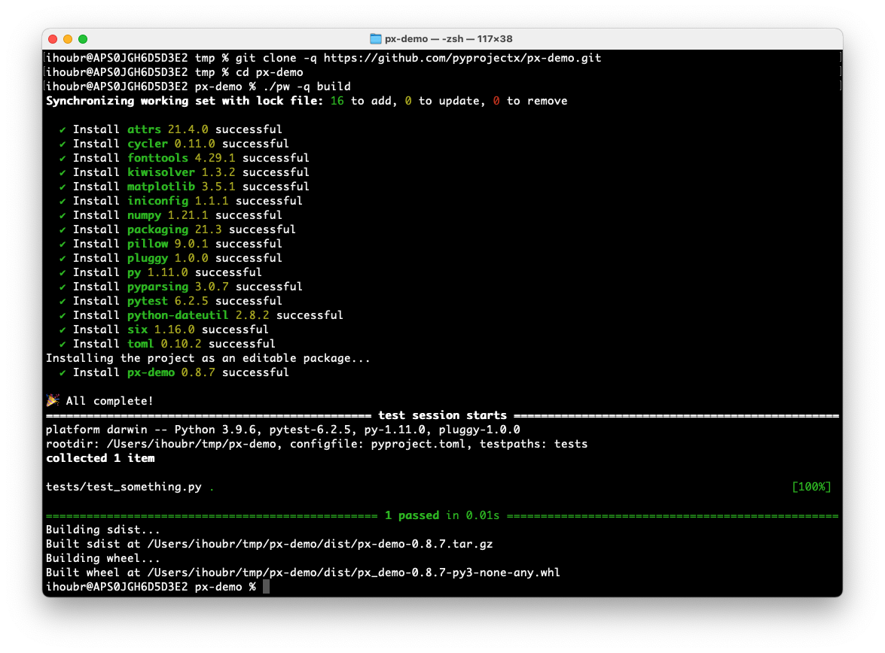

<i class="md-typeset md-header">
ALL-INCLUSIVE PYTHON PROJECTS
</i>

# Introduction
Pyprojectx makes it easy to create all-inclusive Python projects; no need to install any tools upfront,
not even Pyprojectx itself!

## Feature highlights
* Reproducible builds by treating tools and utilities as (versioned) dev-dependencies
* No global installs, everything is stored inside your project directory (like npm's _node_modules_)
* Bootstrap your entire build process with a small wrapper script (like Gradle's _gradlew_ wrapper)
* Configure shortcuts for routine tasks
* Simple configuration in _pyproject.toml_

Projects can be build/tested/used immediately without explicit installation nor initialization:
=== "Linux/Mac"
    ```bash
    git clone https://github.com/pyprojectx/px-demo.git
    # for the poetry version: git checkout poetry
    cd px-demo
    ./pw build
    ```
=== "Windows"
    ```powershell
    git clone https://github.com/pyprojectx/px-demo.git
    # for the poetry version: git checkout poetry
    cd px-demo
    pw build
    ```


## Installation
One of the key features is that there is no need to install anything explicitly (except a Python 3.8+ interpreter).

`cd` into your project directory and download the
[wrapper scripts](https://github.com/pyprojectx/pyprojectx/releases/latest/download/wrappers.zip):

=== "Linux/Mac"
    ```bash
    curl -LO https://github.com/pyprojectx/pyprojectx/releases/latest/download/wrappers.zip && unzip -o wrappers.zip && rm -f wrappers.zip
    ```

=== "Windows"
    ```powershell
    Invoke-WebRequest https://github.com/pyprojectx/pyprojectx/releases/latest/download/wrappers.zip -OutFile wrappers.zip; Expand-Archive -Force -Path wrappers.zip -DestinationPath .; Remove-Item -Path wrappers.zip
    ```

With the wrapper scripts in place, you can start adding tools:

=== "Linux/Mac"
    ```bash
    # initialize a PDM project
    ./pw --add pdm,ruff,pre-commit,px-utils
    ./pw pdm init
    # omit './pw' by activating the tool context
    source .pyprojectx/main/activate
    pdm --version
    ruff check src
    # initialize a poetry project
    ./pw --add poetry
    ./pw poetry init
    ```

=== "Windows"
    ```powershell
    # initialize a PDM project
    pw --add pdm,ruff,pre-commit,px-utils
    pw pdm init
    # omit 'pw' by activating the tool context
    source .pyprojectx/main/activate
    pdm --version
    ruff check src
    # initialize a poetry project
    pw --add poetry
    pw poetry init
    ```

!!! tip "Tip: Add the wrapper scripts to version control"
    When using Git:
    ```shell
    git add pw pw.bat
    git update-index --chmod=+x pw
    echo .pyprojectx/ >> .gitignore
    ```

!!! tip "Tip: Install the `px` utility script"
    You can copy a small script to `.pyprojectx` in your home directory.
    When added to your _PATH_, you can replace `./pw` with the shorter `px`.
    This also works from subdirectories: `../../pw` can also be replaced with `px`

    === "Linux/Mac"
        ```bash
        ./pw --install-px
        ```

    === "Windows"
        ```powershell
        pw --install-px
        ```

If you don't want to prefix every command with `px` or `./pw`, you [can activate a tool context](/config/tools#tool-context-activation).
