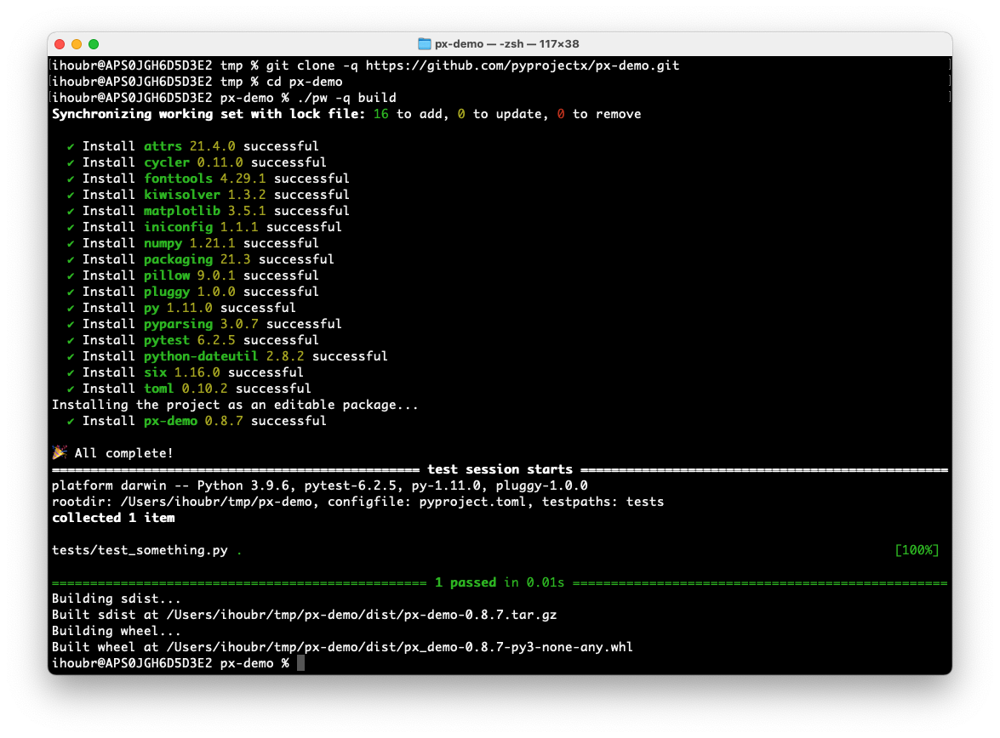
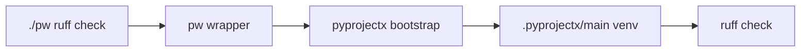

<i class="md-typeset md-header">
ALL-INCLUSIVE PYTHON PROJECTS
</i>

# Introduction
Pyprojectx makes it easy to create all-inclusive Python projects; no need to install any tools upfront,
not even Pyprojectx itself!

## Feature highlights
* Reproducible builds by treating tools and utilities as (versioned) dev-dependencies
* No global installs, everything is stored inside your project directory (like npm's _node_modules_)
* Bootstrap your entire build process with a small wrapper script (like Gradle's _gradlew_ wrapper)
* Configure shortcuts for routine tasks
* Simple configuration in _pyproject.toml_

Projects can be built/tested/used immediately without explicit installation nor initialization:
=== "Linux/Mac"
    ```bash
    git clone https://github.com/pyprojectx/px-demo.git
    # the demo project uses uv as build tool, but has branches for pdm and poetry
    cd px-demo
    ./pw build
    ```

=== "Windows"
    ```powershell
    git clone https://github.com/pyprojectx/px-demo.git
    # the demo project uses uv as build tool, but has branches for pdm and poetry
    cd px-demo
    pw build
    ```



## How it works

When you run `./pw <command>`, the wrapper script:

1. **Bootstraps** Pyprojectx itself if needed (first run only)
2. **Reads** tool contexts from the `[tool.pyprojectx]` section in `pyproject.toml`
3. **Creates or reuses** an isolated virtual environment under `.pyprojectx/`
4. **Runs** the command inside that virtual environment


```mermaid
flowchart LR
    A["./pw ruff check"] --> B["pw wrapper"]
    B --> C["pyprojectx bootstrap"]
    C --> D[".pyprojectx/main venv"]
    D --> E["ruff check"]
```

Everything is stored inside your project directory -- nothing is installed globally, and no tool leaks into another project.

## Get started

No need to install anything except a Python 3.9+ interpreter.

**[Get Started &rarr;](getting-started.md)**
