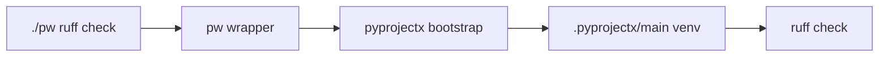

<i class="md-typeset md-header">
ALL-INCLUSIVE PYTHON PROJECTS
</i>

# Introduction
Pyprojectx makes it easy to create all-inclusive Python projects; no need to install any tools upfront,
not even Pyprojectx itself!

## Feature highlights
* **Pin tool versions per project** -- different projects (or branches) can use different versions of uv, ruff, or any tool
* **Full transitive dependency locking** with `pw.lock` -- not just the tool version, but every indirect dependency is pinned
* **Built-in task runner** with [aliases](/config/aliases) -- replace Makefiles and shell scripts with composable, cross-platform shortcuts
* **No global installs** -- everything is stored inside your project directory (like npm's _node_modules_)
* **Zero-setup bootstrap** with a small wrapper script (like Gradle's _gradlew_ wrapper) -- no pre-install required, not even Pyprojectx itself
* Simple configuration in _pyproject.toml_

## Why Pyprojectx?

If you already use **uv**, you might wonder what Pyprojectx adds. Here's the short version:

- **`uv tool run` / `uvx`**: Great for one-off commands, but environments are ephemeral -- there's no version pinning and no lock file, so you have no guarantee the same versions run tomorrow or on CI.
- **`uv tool install`**: Pins a tool version, but globally. Two projects can't use different ruff versions, and transitive dependencies aren't locked.
- **Pyprojectx**: Each project (and branch) carries its own tool versions in `pyproject.toml` + `pw.lock`. Full transitive locking means builds are reproducible down to every indirect dependency. On top of that, [aliases](/config/aliases) give you a built-in task runner -- no Makefile or shell scripts needed.

Projects can be built/tested/used immediately without explicit installation nor initialization:
=== "Linux/Mac"
    ```bash
    git clone https://github.com/pyprojectx/px-demo.git
    # the demo project uses uv as build tool, but has branches for pdm and poetry
    cd px-demo
    ./pw build
    ```

=== "Windows"
    ```powershell
    git clone https://github.com/pyprojectx/px-demo.git
    # the demo project uses uv as build tool, but has branches for pdm and poetry
    cd px-demo
    pw build
    ```


## How it works

When you run `./pw <command>`, the wrapper script:

1. **Bootstraps** Pyprojectx itself if needed (first run only)
2. **Reads** tool contexts from the `[tool.pyprojectx]` section in `pyproject.toml`
3. **Creates or reuses** an isolated virtual environment under `.pyprojectx/`
4. **Runs** the command inside that virtual environment


```mermaid
flowchart LR
    A["./pw ruff check"] --> B["pw wrapper"]
    B --> C["pyprojectx bootstrap"]
    C --> D[".pyprojectx/main venv"]
    D --> E["ruff check"]
```

Everything is stored inside your project directory -- nothing is installed globally, and no tool leaks into another project.

## Get started

No need to install anything except a Python 3.9+ interpreter.

**[Get Started &rarr;](getting-started.md)**
